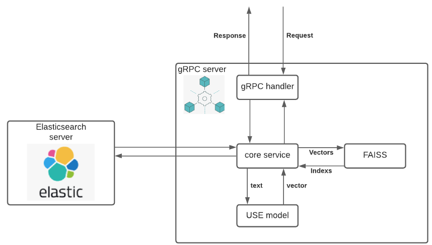

# GRPC CORE

## Graph



## Setup

1. Create and activate python environment:

```bash
python -m venv env&&source env/bin/activate
```

2. Install all requirement packages

```bash
pip install -r r.txt --upgrade pip
```

3. Create necessary directory

```bash
mkdir use/model search/data
```

4. Generate USE model:

```bash
python use/gen_use_model.py
```

5. Generate python code from protobuf file

```bash
python protobuf/gen_python_code.py
```

## Start server

### Using python environment

```bash
python server.py
```

### Using docker:

Generate image:

```bash
docker build -t rss-core:latest .
```

Start server:

```bash
docker run \
    -p 9090:9090 \
    -v $(pwd)/search/data:/app/search/data \
    rss-core:latest
```

Or using image from dockerhub:

```bash
docker run \
    -p 9090:9090 \
    -v $(pwd)/search/data:/app/search/data \
    baristi000/rss-core:0.0.1
```
